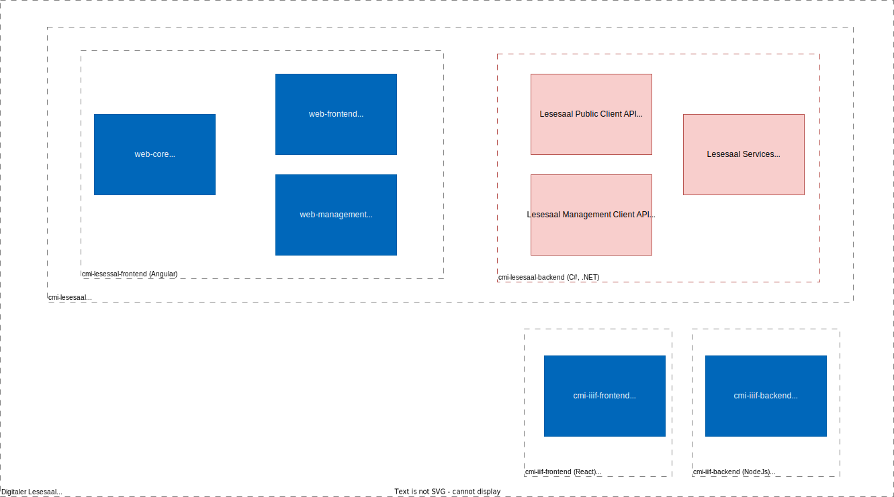

# cmi-lesesaal-web-core
- [cmi-lesesaal](https://github.com/AkrosAG/cmi-lesesaal)
   - **[cmi-lesesaal-web-core](../web-core)** :triangular_flag_on_post:
   - [cmi-lesesaal-web-frontend](../frontend)
   - [cmi-lesesaal-web-management](../web-management)
   - [cmi-lesesaal-backend](../../)

# Context

The [Lesesaal](https://github.com/AkrosAG/cmi-lesesaal) project includes 4 code Modules. The present module `cmi-lesesaal-web-core` is an Angular library. This library is used in the other two applications _public access_ ([cmi-lesesaal-web-frontend](https://github.com/AkrosAG/cmi-lesesaal-web-frontend)) and _internal management_ ([cmi-lesesaal-web-management](https://github.com/AkrosAG/cmi-lesesaal-web-management)) as a common code base and component library. The frontend applications are hosted in an `ASP.NET` container (see _backend_ repository [cmi-lesesaal-backend](https://github.com/AkrosAG/cmi-lesesaal-backend)) and communicate with the system via web API.

> Note: A general description of the repositories can be found in the repository [cmi-lesesaal](https://github.com/AkrosAG/cmi-lesesaal).

# Architecture and components

This is an Angular CLI library published in an internal package feed and included in the [cmi-lesesaal-web-frontend](../web-frontend) and [cmi-lesesaal-web-management](../web-management) projects.
It contains components, services and model classes that are needed in both projects.

## Modules

- `core`
  - Common components for running the application, e.g. Configs, BreadCrumbs, ErrorHandling, Modals
- `orders`
  - Components for the order management part in the public and management client
- `tooltip`
  - Tooltip component
- `wijmo`
  - Custom implementation of the Wijmo grid with extended functionality (e.g. save sort states, filters, etc.)
  - Note: For productive use of this component a Wijmo license is required. It can be ordered at `https://www.grapecity.com/wijmo/licensing`.

# Installation

## Preparations

- [Node.js download](https://nodejs.org/en/), LTS-version
- Make sure that old angular/cli versions are uninstalled
  - `npm uninstall angular-cli`
  - `npm uninstall @angular/cli`
  - `npm cache clean --force`
- Install Angular CLI
  - `npm install -g @angular/cli`

## Install

- Install packages with `npm i`
- Build library with `npm run build`

# Customization

## General

- Pay attention to TSLint
- Move business logic to services

## Run tests

- Run tests once `ng test --watch=false`
- Run tests as watcher `ng test`

## Embedding the library

The library `cmi-lesesaal-web-core` must be delivered as part of an application.

- Either this is done via the internal MyGet feed using `npm i` in the application (e.g.: `cmi-lesesaal-web-frontend`)
- Or the library can be included locally. For this, the following steps are required:
  - Make sure that `cmi-lesesaal-web-core`, `cmi-lesesaal-web-management` and `cmi-lesesaal-web-frontend` are in the same root in the filesystem (e.g. `C:\Lesesaal`).
  - Build the library `cmi-lesesaal-web-core` with `npm run build`.
  - In the target application (e.g. `cmi-lesesaal-web-frontend`) link the library using `npm run link`.

# Authors

- [CM Informatik AG](https://cmiag.ch)
- [Evelix GmbH](https://evelix.ch)
- [Akros AG](https://www.akros.ch)
# License

GNU Affero General Public License (AGPLv3), see [LICENSE](LICENSE.TXT).

# Contribute

Pull requests and merge on these repositories is restricted. However, independent copies (forks) are possible under consideration of the AGPLV3 license.

# Contact

- Technical questions or problems concerning the source code can be posted here on GitHub via the "Issues" interface.
