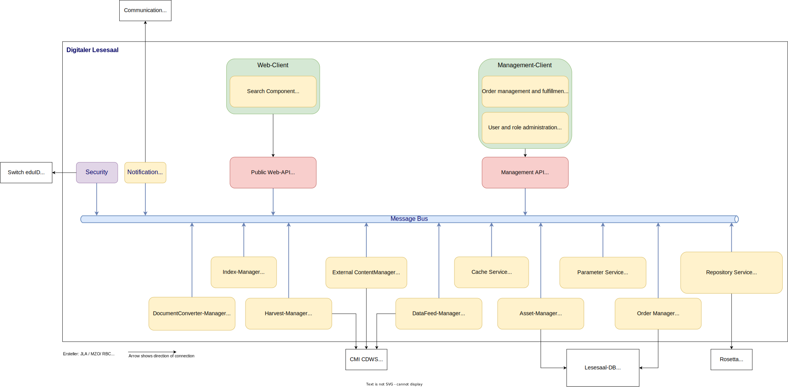

# Architecture

The following image gives an overview of the components and their interactions with the most important external systems of the Lesesaal application: 

The most important systems are briefly described in the following table:

| System | Responsibility |
|--- |--- |
| Switch edu-ID | User Authentication, Single Sign On |
| Lesesaal | System to be created for the online access to meta and primary data, with a focus on search functionality (Information Retrieval) and services for users (Access and Research Services). |
| CMI CDWS | Master for metadata of the units of description as well as authority data and repository management data (locations of analog and digital dossiers) |
| Rosetta | The Rosetta system is designed to enable effective preservation of, and access to, digital heritage collections. With the Rosetta system, large amounts of digital data, including audio, video, and text content, can be stored and managed.
|
| Mailserver | Server responsible for sending mails. This is provided centrally by the central IT department. |

# Components and services 
The components referred to as Lesesaal services in the diagram consist of various Windows services, which are explained in the legend of the diagram. These are now described in more detail in the following chapters.

## Subsystem: Message Bus (RabbitMQ)
All communication between the different services of the Lesesaal system is done via a message bus. Primarily the Publish/Subscribe Pattern is used, with which a service places a message on the bus (Publisher), and this is processed by one or more services (Subscriber).
The use of a message bus results in various advantages:
* Loose coupling of the individual services.
* Scalability. Several subscribers can process one message queue. 
* Fault tolerance. A single service can fail for a short time. The messages are processed after the service is available again.

The product we use is RabbitMQ. It is an open source software which is financed by the company VMWare.
The message bus is one of the central components of the system. Since all other services are affected in the event of a failure, it would be ideal to set up the message bus as a cluster. This way, the failure of a single machine does not lead to a failure of the whole system. 

## Subsystem: Full-text server
Elasticsearch is envisioned as the full-text server. This product enables the search in the search index (information retrieval). The preparation of the data for indexing is done by the Index Manager (Data Integration Layer).

## Subsystem: Database
This subsystem stores queries and orders (Access and Research Services) and logs for audits and statistics (Access and Research Services, Information Retrieval, Data Integration Layer). 
MS SQL Server is used as the database system.

## Subsystem: Cache / File Storage
On the one hand, this subsystem stores usage copies for download by users (Information Retrieval). On the other hand, the system is needed to store temporary files that are needed during the processing of primary data. E.g. the AIP packages extracted by the Rosetta have to be stored before they can be stored in the full text index by the index manager.

## Subsystem: Lesesaal system
This chapter describes the different services of the Lesesaal system. These are Windows services that communicate with each other via the message bus. These services make up the actual part of the application.

### Service: Public-Web API
An IIS web server hosts the end user's web application. The application is created using Angular and consists of HTML pages and JavaScript code. This application is executed in the user's browser. This application accesses a public rest service that provides the data. This public rest service is the "access" into the Lesesaal system for external systems. This REST service can be accessed as an Anonymous user, in which case only the public data is returned. If the user is authenticated, the data is returned according to the user's permissions.
The service routes the requests to the message bus, where the various services process the message and in turn put the response on the bus, from where the rest service picks up the response and delivers it back to the end user.

### Service: Data Feed Manager
The task of the data feed manager is to supply the harvest manager with data that needs to be updated. To do this, the Data Feed Manager reads the data to be updated from the CMI CDWS on a regular interval. 

Technical Notes
* The Data Feed Manager detects new, changed and deleted metadata in the CMI CDWS that is relevant for the Lesesaal application. 
* Triggers are defined in the CMI CDWS that store in an additional table the primary keys of the directory entities that have been newly inserted, modified or deleted.
* The Data Feed Manager executes the updates at least once a day . The UoDs to be changed are read from the new change table of the CMI CDWS. 

### Service: Harvest Manager
The Harvest Manager fetches all the metadata required for indexing and for order management from CMI CDWS and creates a data object from it. Any binary data is stored in the cache/file storage in a further operation. Once the metadata and files of a UoD have been extracted, the component sends the data object in a message via the message bus. These messages are processed by the corresponding services of the Lesesaal system, where e.g. the index manager receives the message with the data object. This uses the data object for full text indexing. 

Technical notes
* In the metadata of the units of description in CMI CDWS, it is noted whether there is primary data for this unit. If  primary data for a UoD exists, the primary data is fetched from the Rosetta via the Rosetta Data Access Service. 
* If new primary data is added to the Rosetta, e.g. from the Vecteur process, the CMI CDWS is informed and the UoD is updated. 
* The Harvest Manager sends notifications to the message bus. These messages contain the metadata prepared by the Harvest Manager. The data is stored in the full text database by the Lesesaal services. 

### Service: Index Manager
The Index Manager is responsible for indexing (Data Integration Layer and Information Retrieval requirements). It receives the data objects from the message bus and prepares the data for optimal searching.

Technical notes
* The Index Manager receives the metadata to be indexed from the Harvest Manager. Based on the data objects and the primary data from the file storage, the data is loaded into the full text index. 
* Once indexing of a UoD is complete, all temporary files and primary data obtained from the Rosetta are deleted. 

### Service: Asset Manager
The Asset Manager has the task of providing and preparing digital records (assets). By assets, we primarily mean the primary data from the Rosetta. 
* The asset manager reads the primary data from the Rosetta via the repository. This is done via a message bus call to the Rosetta data access component. This then retrieves the data from the Rosetta.
* The Asset Manager enables extraction of full text from the primary data (Data Integration Layer requests). Full text extraction involves performing OCR or extracting the text from PDF/A files. Abbyy-FineReader Engine is used as the OCR engine.
* The Asset Manager performs the task of creating a working copy from the individual files belonging to a dossier (or document). This is done by transforming the data from the formats used in Rosetta into formats suitable for download by the user
* The asset manager creates "usage copies" for download by users (information retrieval requirements). 
* Usage copies are cached so that they do not have to be recreated each time they are accessed. 
* Primary data under protection period that are prepared for a SFA employee or an employee of an government office must be stored in a password-protected ZIP file (AES 256 encrypted) according to the security requirements.
* Primary data under the protection period that is prepared for external users with an inspection request can be stored in a password-protected ZIP file (AES 256 encrypted). 

### Service: Repository Service
The only task of this service is to retrieve the primary data from the Rosetta and store it in the pre-configured location. The Asset Manager submits the jobs to the Repository Service. 
* The Repository Service makes the metadata that is stored in Rosetta available to the Lesesaal application. 

Technical notes
* The retention periods for the different categories of usage copies can be defined in the management client. The usage copies are deleted from the cache after the threshold has expired.  

### Service: Order Manager 
The Order Manager (or Order Management and Fulfillment OMF) is responsible for recording, managing and fulfilling Access and Research Services orders and requests ("Ask an archivist", "Historical analysis", "Digitization on Demand", inspection requests, reading room orders, administrative loans).

Technical notes
* The OMF component stores the requests and orders in the database.
* The OMF component notifies users via email.
* Digitization requests and reading room orders:
* The OMF component can read the necessary metadata (information about the containers of the dossiers and the magazine locations of the containers) in the database.

### Service: External Content Manager
The ExternalContentManager is responsible for accessing external resources. In the current implementation, the external resource is the archive information system. At a later point in time, this service can be used to integrate other external resources, such as UserContent or other official publications.

### Service: DocumentConverter
The DocumentConverter service has the task of extracting the full text from the primary data in order to subsequently store it in the full text and of converting the primary data to usage copies.

### Service: Parameter
The Parameter Service has the task of providing and managing system parameters for all services centrally.

### Service: Lesesaal
The Lesesaal Service processes all requests and updates to the Lesesaal database.

### Service: Notification Manager
The Notification Manager service has the task of sending the various mails or notifications in the Lesesaal system. It gets the information from the different services and creates the mails using HTML templates.

# Access permissions

## Access tokens and access roles
It must be ensured that a user can only access data for which he is authorized. Access permissions are checked using access tokens. Access tokens define who (entire user groups and/or individuals) has access to which archival unit. Since there are three different types of accesses to a UoD, three different types/fields of access tokens are also needed: 

| field | meaning | example field content |
|--- |--- |--- |
| MetadataAccessTokens | This field indicates who is allowed to see the metadata (Title, Reference Code, Period of Creation, Within Remark etc. ) of this UoD. | Ö1, Ö2, Ö3, AMA,EMA, EB_ S73712434|
| PrimaryDataFulltextAccessTokens |This field indicates who is allowed to search the primary data (the content of documents) of the UoD |Ö2, Ö3, AMA, EMA, EB_S73712434 |
| PrimaryDataDownloadAccessTokens |This field indicates who can download the primary data (usually a ZIP file of the entire dossier, which contains many files). |Ö2, Ö3, AMA, EMA, FG_ S73712434, EB_ S73712434 |

Each unit of description that is stored in the Elasticsearch index contains the MetadataAccessTokens, PrimaryDataFulltextAccessTokens, and PrimaryDataDownloadAccessTokens that govern its access. The display of the primary data snippet in the result list takes into account the authorization according to the PrimaryDataFulltextAccessTokens. 

The values of the AccessTokens again correspond to the access roles that can be assigned to users:

| Role | Description |
|--- |--- |
| Ö1 | Public user without login (anonymous) |
| Ö2 | Registered user with login |
| Ö3 | **Identified** user with login |
| EMA | User within the network of the customer |
| AS | User within a department that has sent material to the arcive |
| AMA | Member from the ETH Archive |
| FG_XXX | XXX is replaced by the unique user ID of a user in the management client, e.g. FG_9742818. The access token is generated by the system when a user is granted access in response of a 'release' request. |
| EB_XXX | XXX is replaced by the unique user ID of a user in the management client, e.g. EB_3929190. The access token is generated in case of an 'insight' approval for a UoD. |

Thus, on the one hand there are access tokens assigned to each individual unit of discription and on the other hand there are access roles of users. If the access token of a unit matches with an access role of the user, the access is allowed. 
